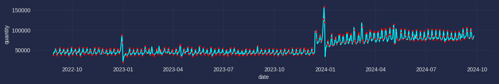

# 🛒 Retail Demand Forecasting - **MLZoomCamp Competition 2024** from [DataTalks.Club's](https://datatalks.club/) by **[Alexander D. Rios](https://linktr.ee/aletbm)**

 

This project was developed as part of the official MLZoomcamp competition, which focused on **forecasting customer demand** in a retail setting using **time series data** from multiple stores and sources.

---

## 🎯 Objective

The aim of this project is to develop a machine learning model that accurately **predicts product demand** for the following month across different stores, based on 25 months of historical data.

This solution supports:

- 📦 Inventory optimization  
- 💸 Reduction of operational costs  
- 📊 Data-driven decision-making

---

## 🧪 Project Structure

The notebook follows a comprehensive pipeline for time series forecasting and includes the following stages:

### 🧹 Data Preprocessing
- Import and memory optimization for all datasets
- Exploratory Data Analysis (EDA) of:
  - Sales
  - Online Sales
  - Markdowns
  - Historical Discounts
  - Stores
  - Catalog
- Merging datasets and handling missing/atypical values
- Normalization and visual distribution analysis

### 🔧 Feature Engineering
- Temporal features: year, month, week of year, day of week
- Seasonality indicators (e.g. holidays, weekends, seasons in Russia)
- Macroeconomic context: GDP per capita
- Cyclical encoding of time features
- Redundant feature removal and memory reduction

### 🧠 Modeling
- Data splitting into training and validation sets
- Pipeline creation and validation framework setup
- Model training and prediction
- Generation of the final submission file

---

## 📊 Tools & Techniques

- **Time series analysis**  
- **Feature engineering** for calendar and economic context  
- **Data visualization**  
- **Memory-efficient pipelines**  
- **Model evaluation** and submission formatting  

---

## 🏁 Competition Info

- **Challenge**: ML Zoomcamp 2024 Competition  
- **Host**: DataTalks.Club  
- **Duration**: Nov 17, 2024 → Feb 9, 2025  
- **Dataset**: 25 months of retail data from 4 stores  

---

## 🏆 Competition Result

This project secured **4th place** in the official **ML Zoomcamp 2024 Retail Forecasting Competition**, among dozens of participants worldwide.  
A great milestone on the journey to becoming a Data Scientist!

---

## 📁 Repository Contents

- `RetailDemandForecasting.ipynb` – main notebook  
- `submission.csv` – prediction file for competition  
- `README.md` – this documentation  

---

## 🙏 Acknowledgments

Thanks to [DataTalks.Club](https://datatalks.club) and [Alexey Grigorev](https://github.com/alexeygrigorev) for providing the learning framework and competition.

---

🖐️ *Thank you for your time! Feel free to explore the code, and feedback is always welcome.*

